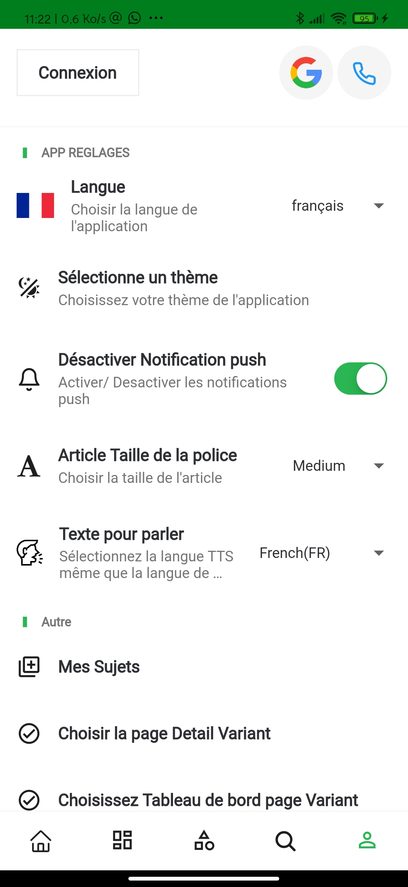
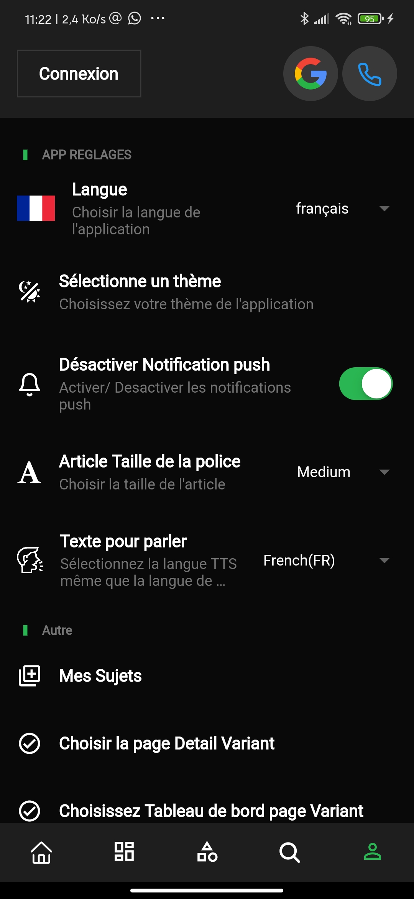
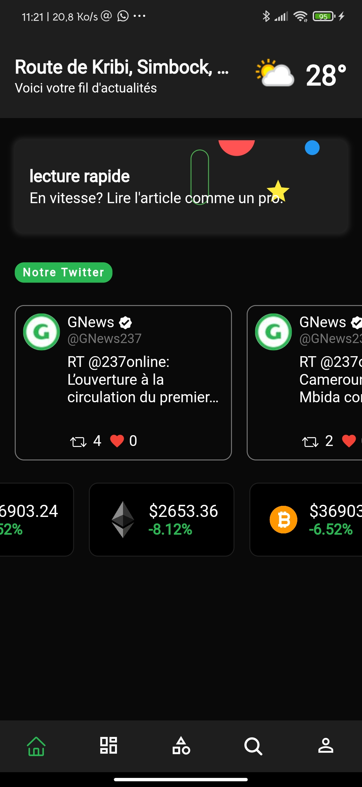
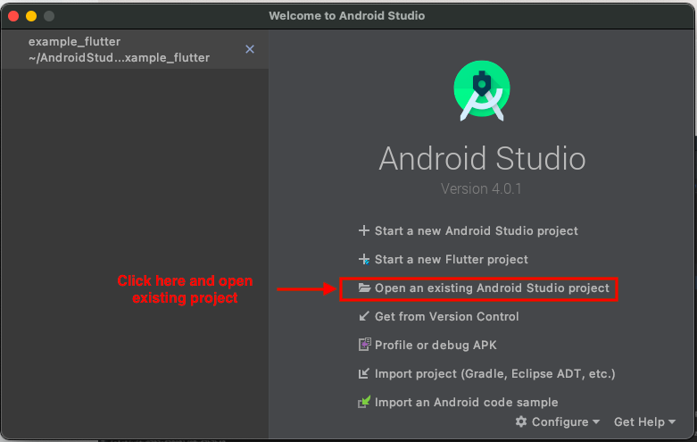
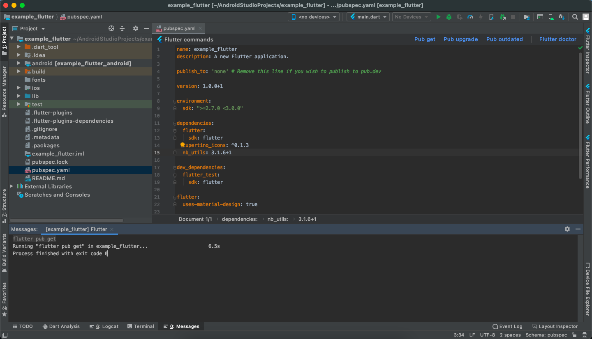
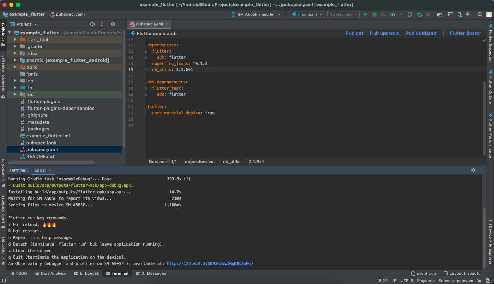
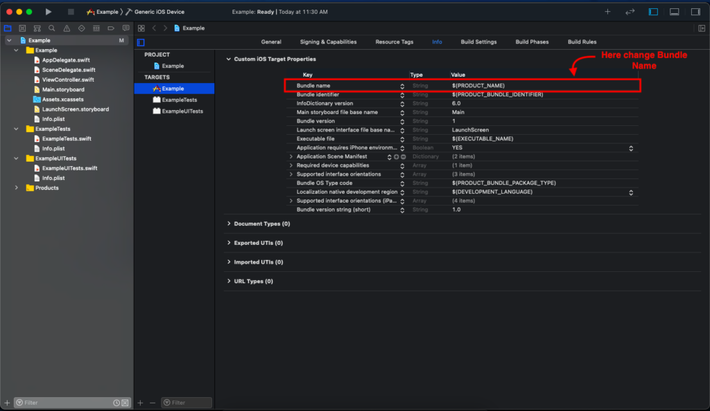
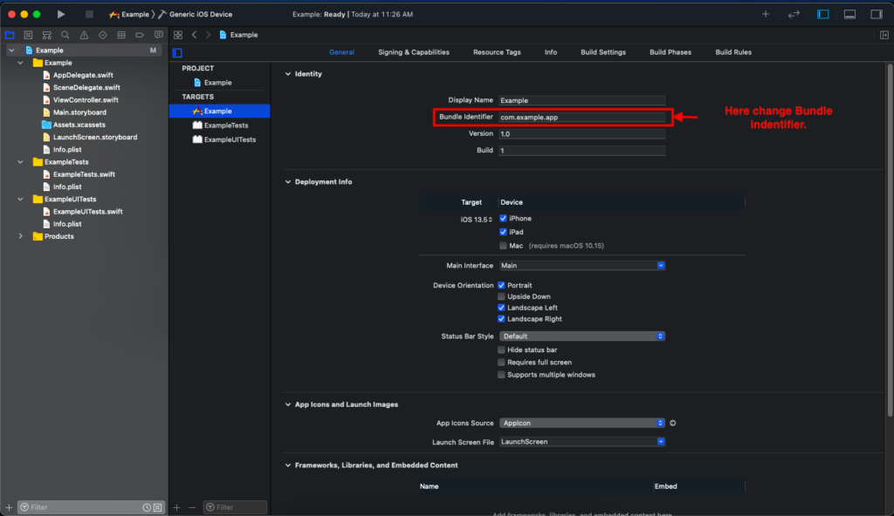
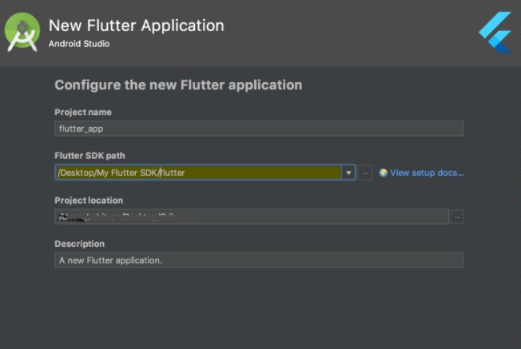

**

GNews
===========

* * * * *







-   [Prerequisite Tools & Setup](#intro)
    -   [Introduction to Flutter](#intro-flutter)
    -   [Tools & Setup](#tools-setup)
    -   [How to Setup Flutter in Android Studio -
        Windows](#setup-windows)
    -   [How to Setup Flutter in Android Studio - macOS](#setup-ios)
    -   [How to Setup Flutter in Android Studio - Linux](#setup-linux)
-   [Getting Started (Build & Run)](#build-run)
-   [Configuration & Customization](#cutomization)
    -   [Android Configuration](#config-android)
    -   [iOS Configuration](#config-ios)
    -   [Firebase Configuration](#basic-loading)
    -   [Flutter Configuration](#basic-fonts)
-   [Common errors](#common-error1)
    -   [No matching client found for package name](#common-error1)
    -   [Flutter SDK Not Available](#common-error2)
    -   [Dependency Error](#common-error3)
    -   [Authorization header not found](#common-error4)
    -   [Expired token](#common-error5)
-   [Frequently asked Question](#faq)

Prerequisite Tools & Setup

* * * * *

### **Introduction to Flutter**

* * * * *

Flutter is Google’s UI toolkit for building beautiful, natively compiled
applications for [mobile](https://flutter.dev/docs),
[web](https://flutter.dev/web), and
[desktop](https://flutter.dev/desktop) from a single codebase. It is
very easy to learn and currently it is getting more and more popular.
With this blog post, you will learn some basic stuff about Flutter and
after reading it, you will be able to create a simple application using
this technology.

[Click here](https://flutter.dev/) to check out more details about
flutter.

### **Tools & Setup**

* * * * *

**Prerequisite**

-   Flutter & Dart [SDK](https://flutter.dev/docs/get-started/install)
-   Anyone IDE [Android Studio](https://developer.android.com/studio)
    (Recommended), [Visual Studio Code](https://code.visualstudio.com/)
    or [IntelliJ IDEA](https://www.jetbrains.com/idea/)

-   To edit this project you must have Flutter and Dart installed and
    configured successfully on your computer.
-   Set up your editor - Install the[Flutter and Dart
    plugins](https://flutter.dev/docs/get-started/editor?tab=androidstudio).
-   If you have got Android SDK installed and configured, to install
    Flutter you only need to:
    -   Download Flutter SDK from official website and extract it.
    -   Add path to previously extracted SDK to your PATH variable
    -   Run flutter doctor tool to check if everything is configured
        correctly.
    -   All above steps are mentioned here:
        [https://flutter.dev/docs/get-started/install/](https://flutter.dev/docs/get-started/install/)

### How to Setup Flutter in Android Studio – Windows​

-   Download Android Studio -
    [https://developer.android.com/studio/](https://developer.android.com/studio/)
-   Get the Flutter SDK -
    [https://flutter.dev/docs/get-started/install](https://flutter.dev/docs/get-started/install)
-   Learn more about Android Studio -
    [https://developer.android.com/studio/intro/](https://developer.android.com/studio/intro/)

**Step 1 : Get the Flutter SDK**

1 Download the following installation bundle to get the latest stable
release of the Flutter SDK:

2 Extract the zip file and place the contained flutter in the desired
installation location for the Flutter SDK (for example,
C:\\src\\flutter; do not install Flutter in a directory like C:\\Program
Files\\ that requires elevated privileges).

**Step 2 : Update your paths**\

If you wish to run Flutter commands in the regular Windows console, take
these steps to add Flutter to the PATH environment variable: From the
Start search bar, enter ‘env’ and select **Edit environment variables
for your account.** Under **User variables**check if there is an entry
called **Path:**

-   If the entry exists, appendthe full path to **flutter\\bin**using ;
    as a separator from existing values.
-   If the entry doesn’t exist, create a new user variable named Path
    with the full path to **flutter\\bin** as its value.

**Important**

Note that you have to close and reopen any existing console windows for
these changes to take effect.

**You are now ready to run Flutter commands in the Flutter Console!**

**Step 3 : Run flutter doctor**\

From a console window that has the Flutter directory in the path (see
above), run the following command to see if there are any platform
dependencies you need to complete the setup:

``` {.brush: .shell}
C:\src\flutter>flutter doctor
```

**If you find any issue during environment setup, please go online
[Click here](https://flutter.dev/docs/get-started/install/windows)**

### **How to Setup Flutter in Android Studio – macOS​** ​

* * * * *

-   Download Android Studio -
    [https://developer.android.com/studio/](https://developer.android.com/studio/)
-   Download Xcode -
    [https://apps.apple.com/us/app/xcode/id497799835?mt=12](https://apps.apple.com/us/app/xcode/id497799835?mt=12)
-   Get the Flutter SDK -
    [https://flutter.dev/docs/get-started/install](https://flutter.dev/docs/get-started/install)
-   Learn more about Android Studio -
    [https://developer.android.com/studio/intro/](https://developer.android.com/studio/intro/)

**Step 1 : Get the Flutter SDK**

-   Download the following installation bundle to get the latest stable
    release of the Flutter SDK:
-   Download SDK and extract downloaded file, just double click on that.
    and just copy extracted folder and paste it to your desired location
    (for example, Documents\\flutter).

**Step 2 : Update your path**

**Important**

Path variable needs to be updated to access “flutter” command from
terminal. you can just update path variable for current terminal window
only. and if you want to access flutter commands from anywhere in
terminal, we need to update SDK path permanently.

To update PATH variable, we need to open terminal.

To update PATH variable for current terminal window only, then enter
this command **"export PATH="\$PATH:\`pwd\`/flutter/bin""**and hit enter
key.

To update PATH variable permanently, then Open or create
**.bash\_profile** file. to open or create that file, then enter **"sudo
open -e \$HOME/.bash\_profile"** and hit enter key.

Append below line to bash\_profile file at bottom of all other content.
**"export
PATH="\$PATH:[PATH\_TO\_FLUTTER\_GIT\_DIRECTORY]/flutter/bin""** as
[PATH\_TO\_FLUTTER\_GIT\_DIRECTORY] is actual path of SDK folder.

Run this command on terminal **"source \$HOME/.bash\_profile"** to
refresh PATH variables.

Then check whether our SDK is successfully installed or not.

**You are now ready to run Flutter commands in the Flutter Console!**

Run **"flutter doctor"** into terminal, If you are getting check list of
flutter sdk requirements, it means SDK is successfully installed on your
machine. and you can start building flutter apps on your machine.

**If you find any issue during environment setup in macos, please go
online [Click
here](https://flutter.dev/docs/get-started/install/macos)**

### **How to Setup Flutter in Android Studio – Linux​​**

* * * * *

-   Download Android Studio -
    [https://developer.android.com/studio](https://developer.android.com/studio)
-   Get the Flutter SDK -
    [https://flutter.dev/docs/get-started/install/linux](https://flutter.dev/docs/get-started/install/linux)
-   Learn more about Android Studio -
    [https://developer.android.com/studio/intro/](https://developer.android.com/studio/intro/)

**Step 1 : Get the Flutter SDK**

-   Download the following installation bundle to get the latest stable
    release of the Flutter SDK:
-   Download SDK and extract downloaded file, just double click on that.
    and just copy extracted folder and paste it to your desired location
    (for example, Documents\\flutter).

**Step 2 : Update your path**

**Important**

Path variable needs to be updated to access “flutter” command from
terminal. you can just update path variable for current terminal window
only. and if you want to access flutter commands from anywhere in
terminal, we need to update SDK path permanently.

You’ll `probably` want to update this variable permanently, so you can
run flutter commands in any terminal session. To update PATH variable,
we need to open terminal.

``` {.brush: .shell}
export PATH="$PATH:[PATH_TO_FLUTTER_GIT_DIRECTORY]/flutter/bin"
```

1.  Run `source $HOME/.`{.language-plaintext .highlighter-rouge} to
    refresh the current window, or open a new terminal window to
    automatically source the file.
2.  Verify that the `flutter/bin`{.language-plaintext
    .highlighter-rouge} directory is now in your PATH by running:

``` {.brush: .shell}
echo $PATH
```

Verify that the `flutter`{.language-plaintext .highlighter-rouge}
command is available by running:

``` {.brush: .shell}
which flutter
```

**You are now ready to run Flutter commands in the Flutter Console!**

Getting Started (Build & Run)

* * * * *

**Important**

All below steps are must be followed to build and run application

**Download Project**

Download and find the your project folder, use your preferred IDE
**(Android Studio / Visual Studio Code / IntelliJ IDEA)** to run the
project.



* * * * *

**Get Dependencies**

After you loaded project successfully, run the following command in the
terminal to install all the dependencies listed in the
[`pubspec.yaml`{style="font-size: 14px;"}](https://dart.dev/tools/pub/pubspec)
file in the project's root directory or just click on Pub get in
pubspec.yaml file if you don't want to use command.

``` {.brush: .shell}
flutter pub get
                                    
```

**Important**

All below steps are must be followed to build and run application



**Build and Run App**

1.  Locate the main Android Studio toolbar.
2.  In the target selector, select an Android device for running the
    app. If none are listed as available, select Tools \> Android \> AVD
    Manager and create one there. For details, see [Managing
    AVDs](https://developer.android.com/studio/run/managing-avds).
3.  Click the run icon in the toolbar, or invoke the menu item Run \>
    Run.


After the app build completes, you’ll see the app on your device.

If you don’t use Android Studio or IntelliJ you can use the command line
to run your application using the following command

**Important**

Below step requires flutter path to be set in your Environment
variables. See https://flutter.dev/docs/get-started/install/windows

``` {.brush: .shell}
flutter run

                                    
```

You will see below like screen after you have build your app
successfully



* * * * *

**Try hot reload**

Flutter offers a fast development cycle with Stateful Hot Reload, the
ability to reload the code of a live running app without restarting or
losing app state. Make a change to app source, tell your IDE or
command-line tool that you want to hot reload, and see the change in
your simulator, emulator, or device.

**Important**

Do not stop your app. let your app run.

Configuration & Customization

* * * * *

**Open Android module in Android Studio**

-   Open Android Studio.
-   Select Open an existing Android Studio Project.
-   Open the android directory within your app.
-   Wait until the project has been synced successfully. (This happens
    automatically once you open the project, but if it doesn’t, select
    Sync Project with Gradle Files from the File menu).
-   Now, click on Run button.

**Change Application Name**

-   You must want to change your application name. This is how you can
    do. Follow the below step.
-   Open /android/app/src/main/AndroidManifest.xml and specify your
    application name.

**Change Application Icon**

-   See How to generate an application icon?
-   Browse your image and click on Download icon. After successfully
    generated, replace all icons in respective folders:

-   /mipmap-hdpi in /android/app/src/main/res/ folder
-   /mipmap-mdpi in /android/app/src/main/res/ folder
-   /mipmap-xhdpi in /android/app/src/main/res/ folderr
-   /mipmap-xxhdpi in /android/app/src/main/res/ folder
-   /mipmap-xxxhdpi in /android/app/src/main/res/ folder

**Important:**

Application icon name must be ic\_launcher

**Change Application ID**

-   Follow the below steps to change you Application ID.
-   Open /android/app/build.gradle

### **iOS Configuration** {.block-title}

* * * * *

**Open Project in Xcode**

-   Open Xcode.
-   Select Open another Project.
-   Open the iOS directory within your app.
-   Now, click on Done button.

**Change Bundle Name**

-   Select your project file icon in Group and files panel.
-   Then Select Target -\> Info Tab.
-   At last change Bundle Name.



* * * * *

**Change Bundle Identifier.**

Bundle Id is a unique Identifier of your of app on iOS and MacOS. iOS
and MacOS use it to recognise updates to your app. The identifier must
be unique for your app.

-   Select your project file icon in Group and files panel.
-   Select General Tab.
-   After Select General tab you can see the details of your
    application.
-   In Identity section, rename your Bundle identifier.



* * * * *

**Change App Icons**

-   see How to Generate App Icons?
-   In Group and files panel find “Assets.xcassets” folder.
-   In Assets.xcassets folder replace AppIcon.

### **Firebase Configuration** {.block-title}

* * * * *

**Create a Firebase project**

Before you can add Firebase to your Flutter app, you need to create a
Firebase project to connect to your app. Visit [Understand Firebase
Projects](https://firebase.google.com/docs/projects/learn-more) to learn
more about Firebase projects.

**Important:**

If you're releasing your Flutter app on both iOS and Android, register
both the iOS and Android versions of your app with the same Firebase
project.

###### Visit for more information on [how to setup for Android](https://firebase.google.com/docs/flutter/setup?platform=android)

###### Visit for more information on [how to setup for iOS](https://firebase.google.com/docs/flutter/setup?platform=ios)

**Register your app with Firebase**

-   In the center of the [Firebase console's project overview
    page](https://console.firebase.google.com/?pli=1), click the Android
    icon to launch the setup workflow.
-   Enter your app's package name in the Android package name field.
-   Click Register app.

**Add a Firebase configuration file**

-   Click Download google-services.json to obtain your Firebase Android
    config file (google-services.json).
-   Move your config file into the android/app directory of your Flutter
    app.

Follow the instruction for enabling Firebase services in your Android
app
[here](https://firebase.google.com/docs/flutter/setup?platform=android)


### **Flutter Configuration** {.block-title}

**Manually Change Server URL**

In the main directory go to the lib folder -\> utils folder -\> open
Constant.dart file change your Base URL.

``` {.brush: .html}
                                        const mBaseUrl = 'Enter your base URL';
                                    
```

Common Errors

* * * * *

### **No matching client found for package name** {.block-title}

* * * * *

-   The error is "package\_name" in google-services.json is not matching
    with your "applicationId" in app gradle.
-   Just make sure the `package_name` and `applicationId` both are same.

Learn more at [\>firebase-configuration](#basic-loading)

### **Flutter SDK Not Available** {.block-title}

* * * * *

Download the SDK and point the SDK folder path in your future projects.

There are different sources you can try

1.  You can clone it from the [Github
    Repository](https://github.com/flutter/flutter)
2.  [Download SDK
    zip](https://flutter.dev/docs/get-started/install/macos#get-the-flutter-sdk)
    file + extract it after downloading
3.  You can also Download [any
    version](https://flutter.dev/docs/development/tools/sdk/releases?tab=macos)(including
    older) from here (For Mac, Windows, Linux)

#### Use the SDK path in your future projects

### **Flutter SDK Not Available** {.block-title}

* * * * *

Download the SDK and point the SDK folder path in your future projects.

There are different sources you can try

1.  You can clone it from the [Github
    Repository](https://github.com/flutter/flutter)
2.  [Download SDK
    zip](https://flutter.dev/docs/get-started/install/macos#get-the-flutter-sdk)
    file + extract it after downloading
3.  You can also Download [any
    version](https://flutter.dev/docs/development/tools/sdk/releases?tab=macos)(including
    older) from here (For Mac, Windows, Linux)

#### Use the SDK path in your future projects



### **Dependency Error** {.block-title}

* * * * *

**When you run the application and you see error like this\
**

``` {.brush: .html}
                                  Running "flutter pub upgrade" in prokit-flutter...
                                    
                                    The current Flutter SDK version is 1.17.5.
                                    
                                    Because prokit_flutter depends on flutter_svg >=0.18.0 which requires Flutter SDK version
                                    >=1.18.0-6.0.pre <2.0.0, version solving failed. pub upgrade failed (1; Because
                                    prokit_flutter depends on flutter_svg >=0.18.0 which requires Flutter SDK version
                                    >=1.18.0-6.0.pre <2.0.0, version solving failed.) Process finished with exit code 1
                                    Error Possibilities:
                                    Generally, this error occurs when
                                
```

**Error Possibilities:**

Generally, this error occurs when

1.  one of your third party package version is not supported.
2.  your Flutter SDK version not matched with one of your third party
    packages. for ex, your current Flutter SDK version is 1.20.0 and
    third party package targets Flutter SDK version 1.17.0.

#### Solution:

-   look for the latest version of your package in
    [https://pub.dev/packages/YOUR\_PACKAGE\_NAME](https://pub.dev/packages/)
-   or upgrade your flutter version if you don't have the latest with
    **flutter upgrade**command.

After implementing the above solution, run the below command in the
terminal.

``` {.brush: .html}
>flutter pub get
```

### **Authorization header not found** {.block-title}

* * * * *

#### Message: Authorization header not found

Note If you faced this error during development then this error due to
header not set on your admin panel

###### Solution: Just check [Enable JWT Authentication](#basic-authorization) section wordpress document to resolve this issue

### **Expired token** {.block-title}

* * * * *

#### Message: Expired token

This error occurs due to the Expired user token.

###### Solution: Logout and re-login to your flutter app

Important:
----------

We are working on autologin system. we will update it soon.

FAQ

* * * * *

##### **Email not sent ?**

When you get an error of email not sent in forgot password, please
follow below link :

[Email Configuration](#wp-mail-smtp)

* * * * *

##### **Authorization header not found ?**

Add below line in .htaccess file :

``` {.brush: .html}
                                RewriteCond %{HTTP:Authorization} ^(.*)
                                RewriteRule ^(.*) - [E=HTTP_AUTHORIZATION:%1]
                                SetEnvIf Authorization "(.*)" HTTP_AUTHORIZATION=$1
                            
```

* * * * *

